# Library Management Web Application Using Flask.

The library management system is a web application created using Flask that allows the user to -

- Manage **BOOKS** along with their stocks.
- Manage **MEMBERS** and their details.
- Issue books to members.


## Features

### Books
- Add books by optionally specifying the *amount*, *name*, *author* or *ISBN*.
- View existing books and their details.
- Search for a book using the *Title* or *Author*.
- Update the details of a book.
- Delete a specific book.

### Members
- Add new members by specifying the *Name*, *Email* and *Contact*.
- View existing members and their details.
- Search for a member using the *Name*.
- Update the details of a member.
- Delete a specific member.
- View debt and clear debt after payment.

### Issues
- Issue a book to a member by specifying the number of *days* ( default = 7 ).
- Issue a book return from a member.
- Issue warning if member debt exceeds Rs. 500.


## Tech Stack

**Client:** HTML, CSS, JavaScript

**Server:** Flask, Flask SQLAlchemy


## Installation

#### Using Git Bash  
Clone the project.

```bash
  git clone https://github.com/GursheenK/flasklib_app.git
```

#### Alternatively, you can download the zip file by going to Code > Download Zip. After downloading, unzip the file contents. 

Go to the project directory.

```cmd
  cd flasklib_app
```

Create and activate a virtual environment.

```cmd
  python -m venv env
  env\Scripts\activate.bat
```

Install the necessary requirements.

```cmd
  pip install -r requirements.txt
```
Install wkhtmltopdf from the following link - https://wkhtmltopdf.org/downloads.html 


## Deployment

To deploy this project run

```bash
  python run.py
```

Open http://localhost:5000 inside the browser to view the application.

## Screenshots

## Login Page
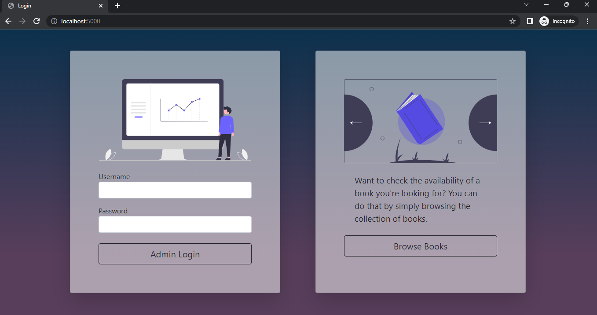

Credentials 

*Username* - admin

*Password* - password

## Dashboard
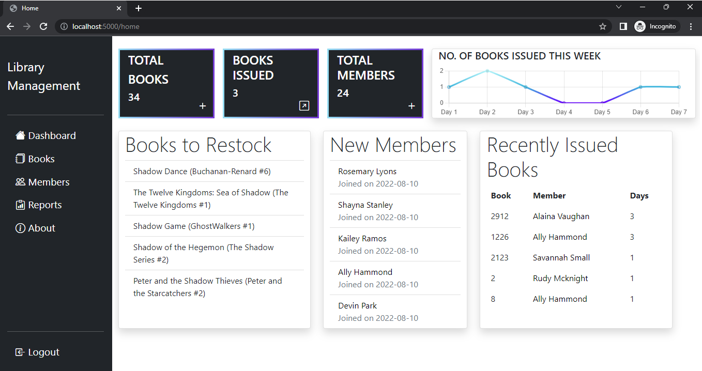


## Books
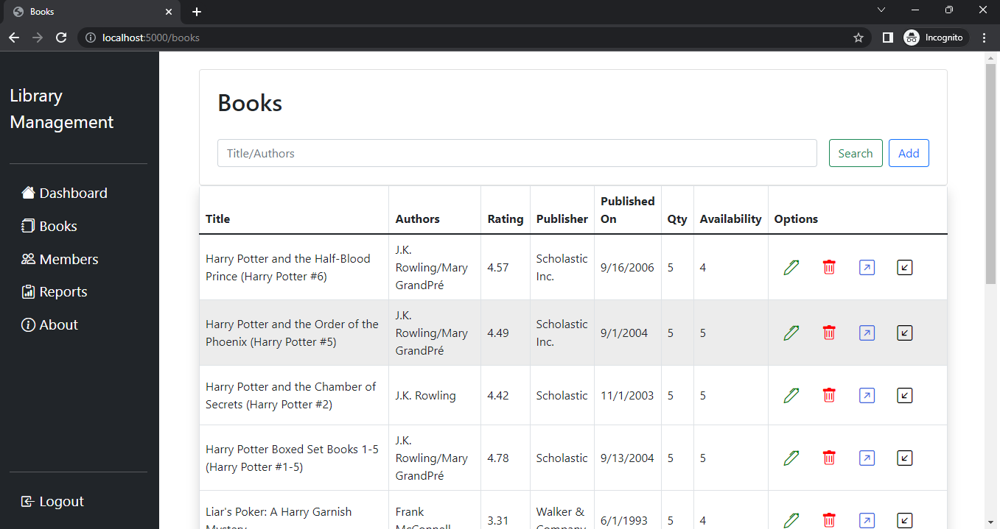

### Searching Books

Can be searched using Title/Author.

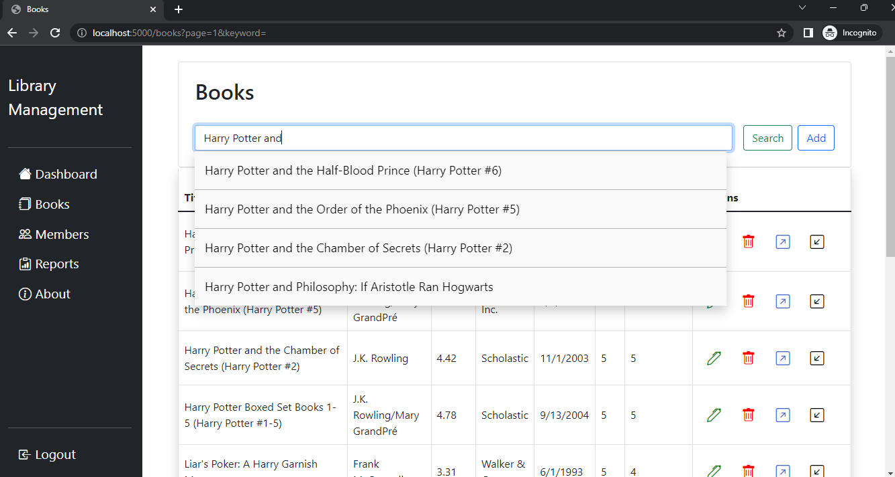

### Importing Books

Can be imported using any parameters.

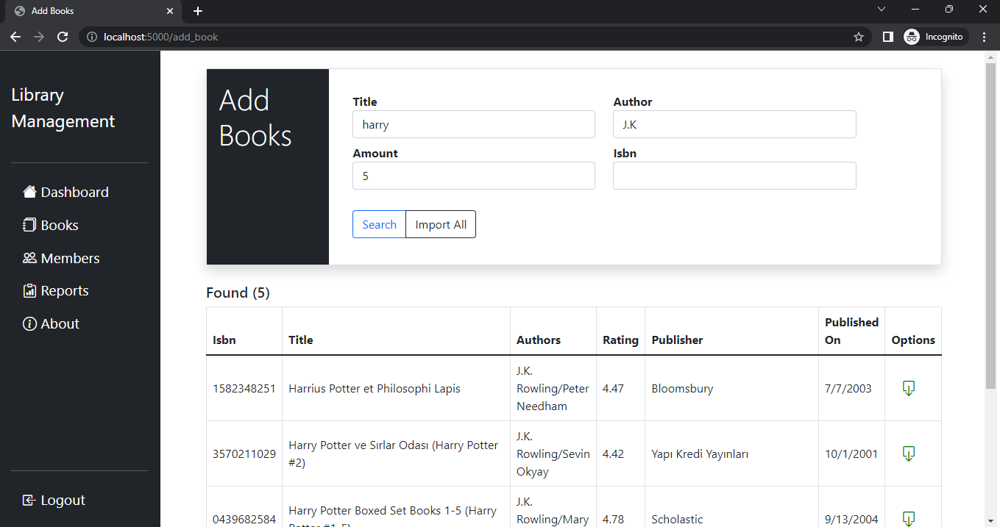

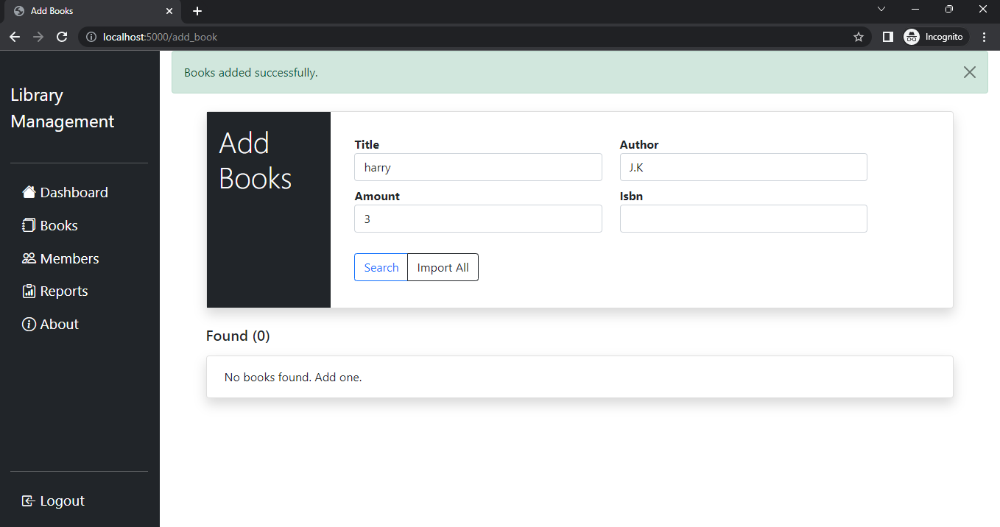

### Updating a book

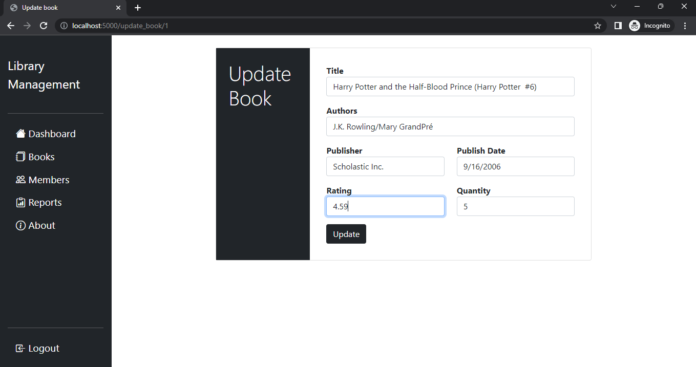

### Deleting a book

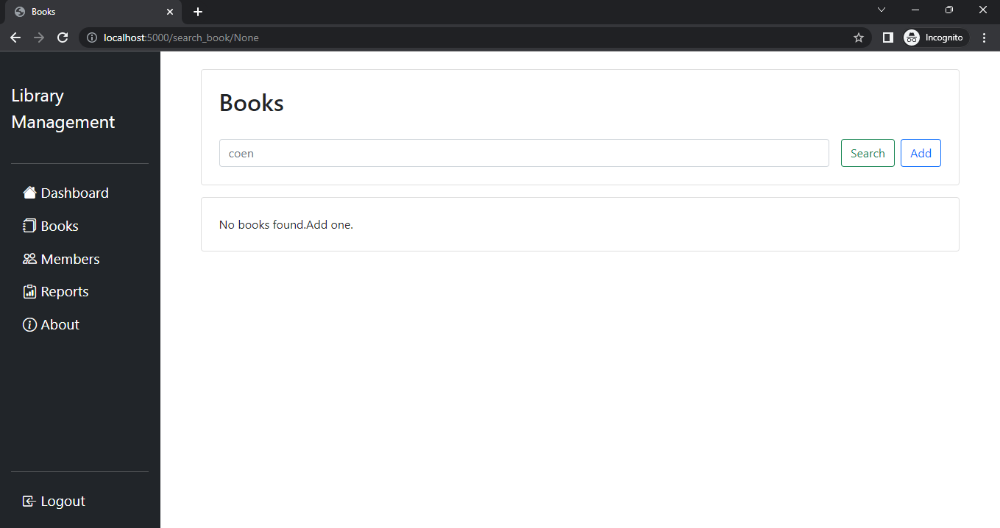


## Members
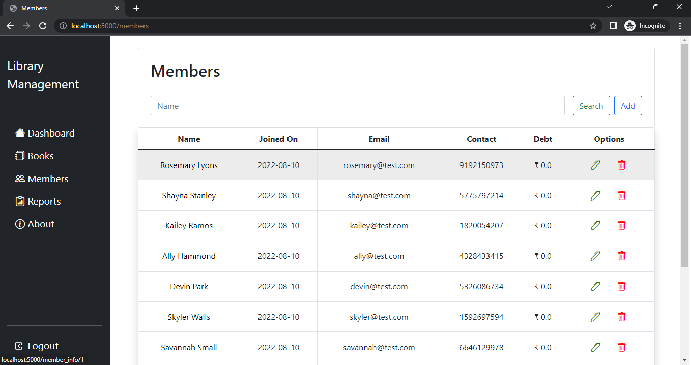

### Adding a Member

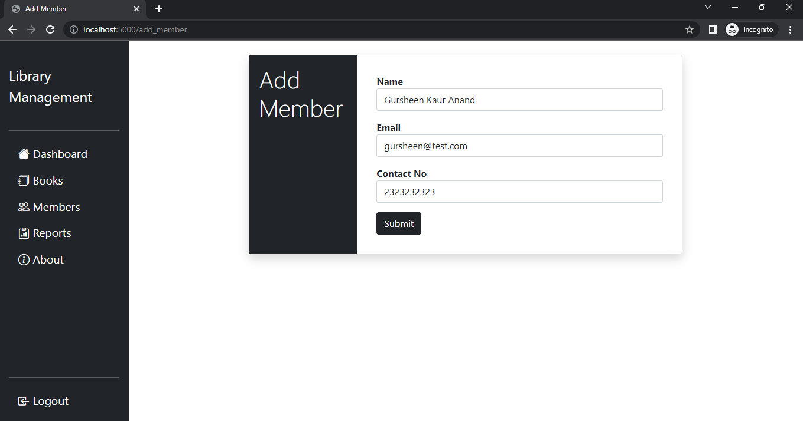

### Viewing Member Information

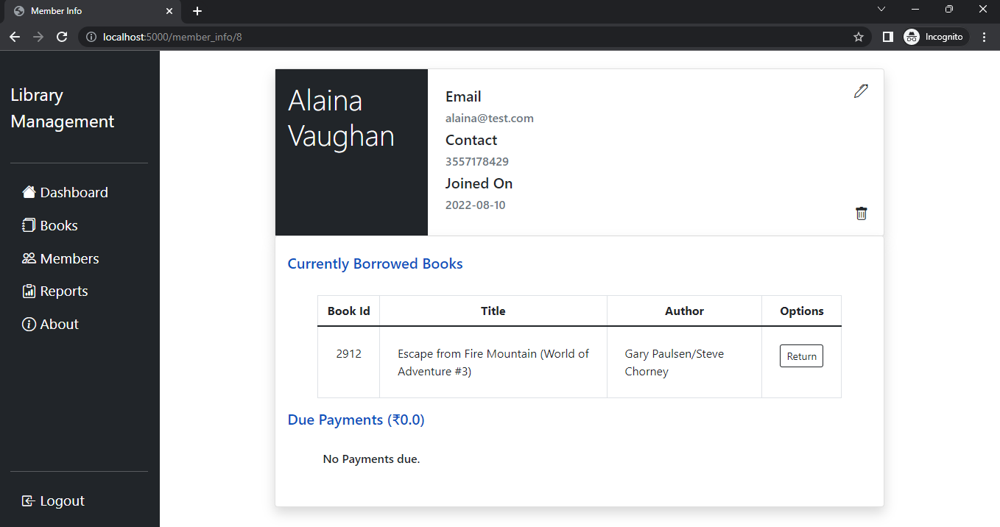

### Updating Member Information

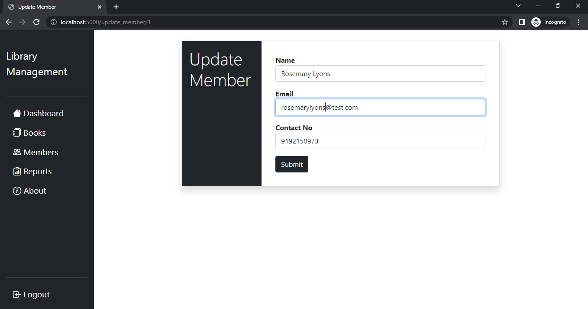

### Deleting a Member

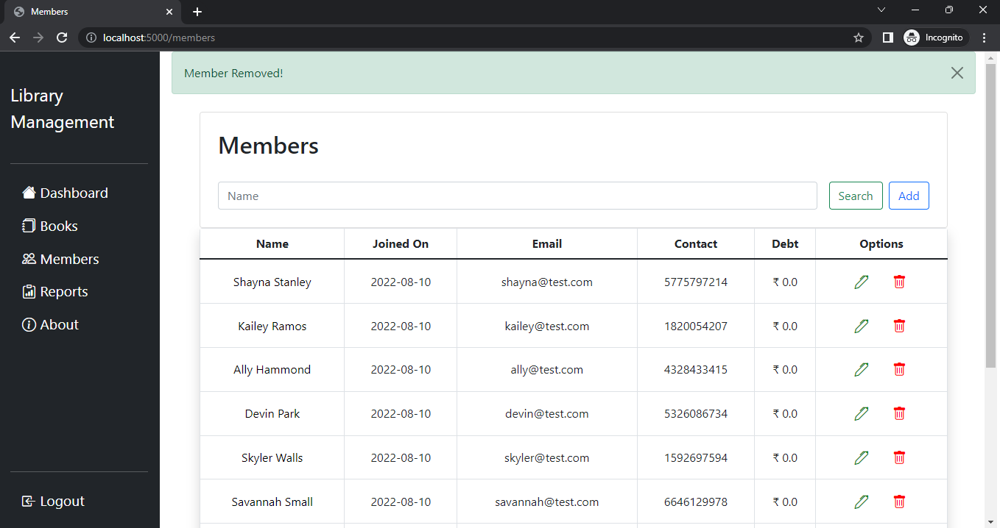


## Issues

### Issuing a book to a Member
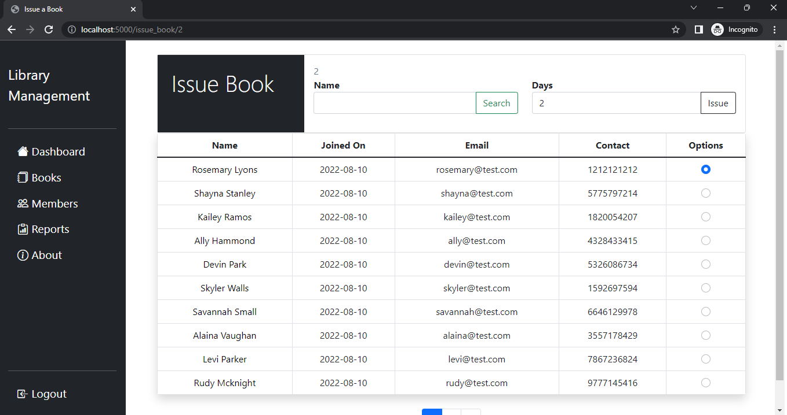

### Issuing a book return from a Member
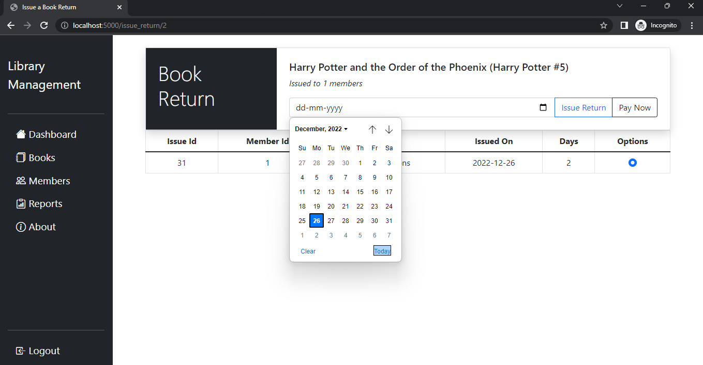


## Reports
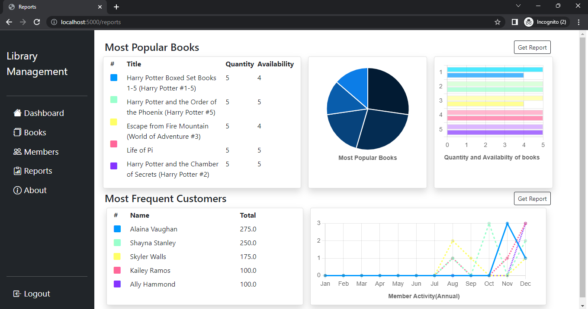

### Books Report PDF
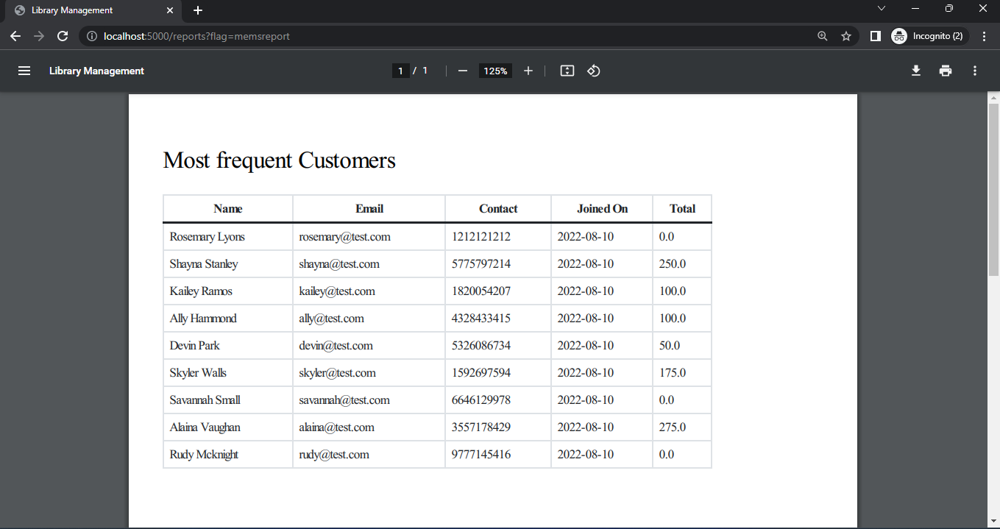

### Members Report PDF
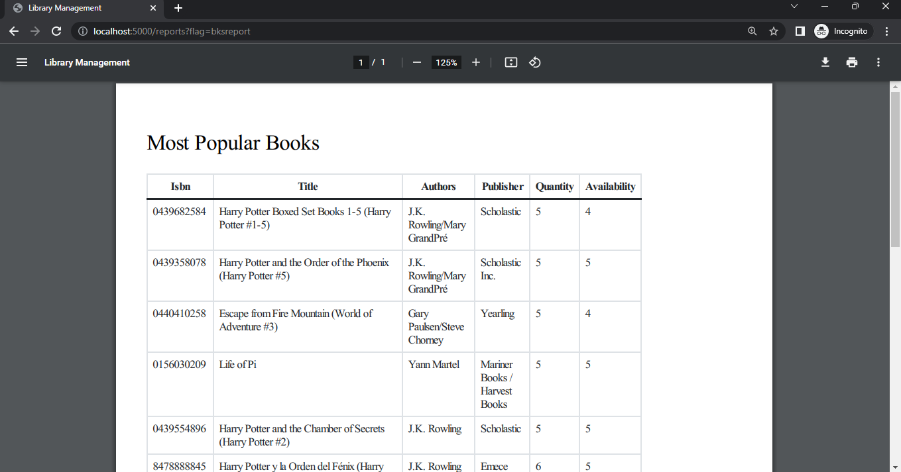


## Guest

Can be viewed by anyone.

### Guest View - Search
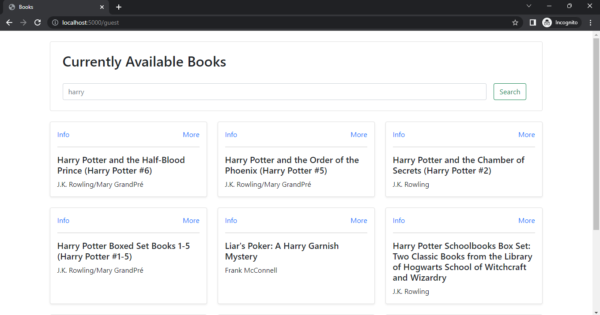

### Guest View - Book Information
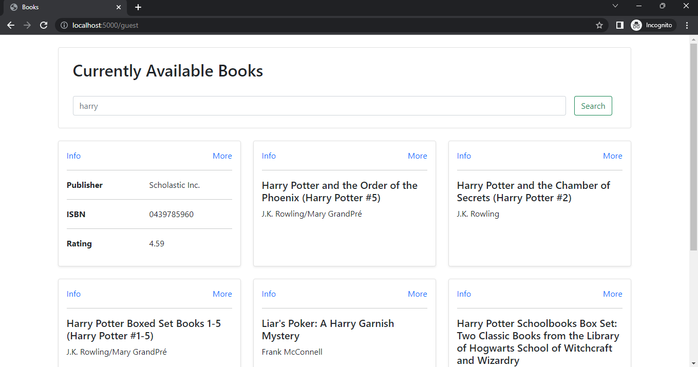

## Documentation

[Flask Documentation](https://flask.palletsprojects.com/en/2.2.x/)

[Flask-SQLAlchemy Documentation](https://flask-sqlalchemy.palletsprojects.com/en/3.0.x/)

[WTForms Documentation](https://wtforms.readthedocs.io/en/3.0.x/)
## 🔗 Links
Live on Render - https://gursheen-flasklib-app.onrender.com/

## Authors

[@GursheenKaurAnand](https://github.com/GursheenK)

